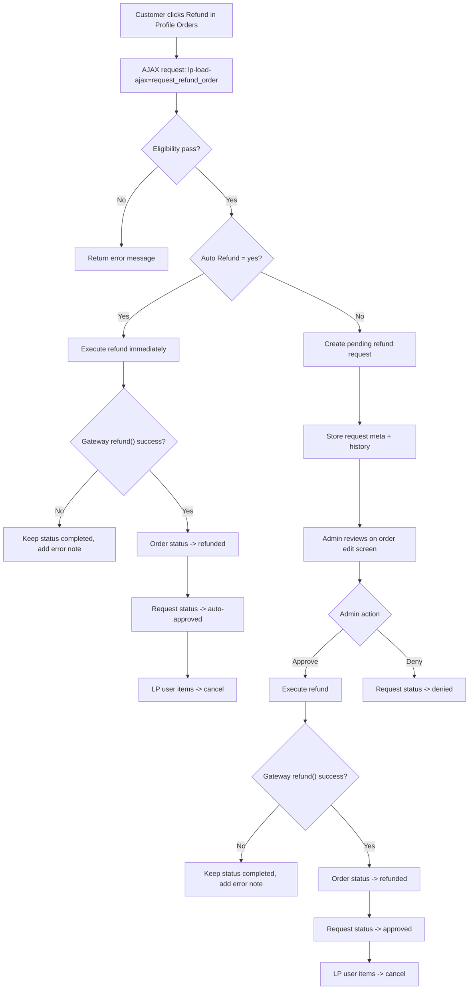
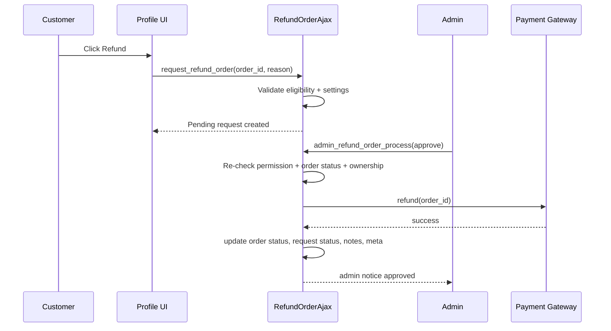

# LearnPress Refund Workflow

## Overview
This document describes the current refund workflow in LearnPress:
- Only logged-in users can request refund (guest is not supported).
- Only gateways with callable `refund()` are treated as refund-capable.
- `refund_max_completion` is an eligibility gate:
  - `0`: no limit by learning progress.
  - `> 0`: reject when `completion_percent > threshold`.
- If gate passes, execution always calls full refund: `refund( $order_id )`.

## Main Flow (Customer + Admin)

## Eligibility Gate Details
- `enable_refund_requests = yes`.
- Order is not guest and not already refunded.
- Order status must be `completed`.
- Payment method must exist in `learn_press_get_order_refund_supported_gateways()`.
- No duplicate pending request.
- Re-request follows `allow_refund_rerequest`.
- Time limit follows `refund_time_limit`.
- Completion gate:
  - Progress source: `UserCourseModel::find(...)->calculate_course_results(true)`.
  - Aggregation: max progress among courses in the order.
  - Reject only when `completion_percent > refund_max_completion` (if threshold > 0).

## Sequence Diagram (Manual Review Path)

## Status and Meta Transition
- Request meta:
  - `_lp_refund_request_status`: `pending|approved|auto-approved|denied`
  - `_lp_refund_requested_by`, `_lp_refund_requested_at`
  - `_lp_refund_reviewed_by`, `_lp_refund_reviewed_at`
  - `_lp_refund_reason`, `_lp_refund_note`
- Audit meta:
  - `_lp_refund_amount` (full order total)
  - `_lp_refund_percent` (`100`)
  - `_lp_refund_completion` (captured completion percent)

## Admin UI Behavior
- Refund request info remains visible on order admin after approved/denied/refunded.
- `Approve Refund` and `Deny Refund` buttons are visible only when status is `pending`.
