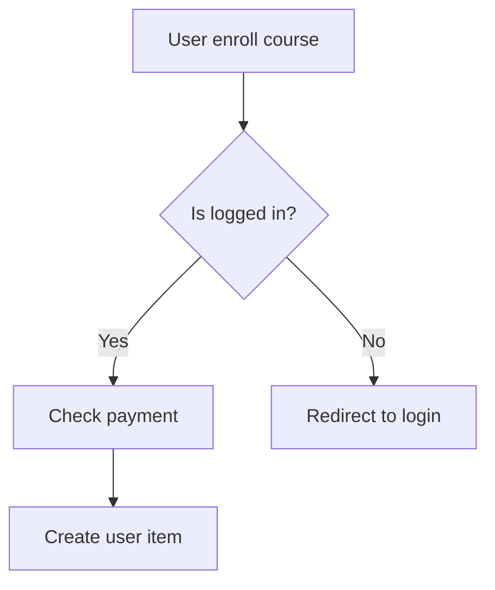

# Flow Chart — LearnPress

Chứa các flowchart, logic diagram, và sequence diagram cho dự án LearnPress.

## Cấu trúc
```
flow-chart/
├── README.md
├── logic/          # Business logic flowcharts
├── diagram/        # Architecture & sequence diagrams
└── *.md            # Mermaid-based diagrams
```

## Định dạng
- Sử dụng **Mermaid** syntax trong file `.md` để vẽ diagram
- Hoặc export hình ảnh `.png`/`.svg` từ draw.io, Excalidraw

## Ví dụ Mermaid


## Folders
- **logic/** — Flowchart xử lý nghiệp vụ (enroll, quiz, order, ...)
- **diagram/** — Kiến trúc hệ thống, class diagram, sequence diagram
