# Purchase Course — Sequence Diagram

```mermaid
sequenceDiagram
    actor User
    participant Template as SingleCourseTemplate
    participant CourseJS as single-course.js
    participant REST as Courses REST Controller
    participant Course as CourseModel
    participant Cart as LearnPress Cart
    participant CheckoutJS as checkout.js
    participant AJAX as LP_AJAX
    participant Checkout as LP_Checkout
    participant Order as LP_Order
    participant Gateway as LP_Gateway_Abstract
    participant Factory as LP_User_Factory
    participant UserCourse as UserCourseModel

    User->>Template: Open single course page
    Template->>Course: can_purchase(user)
    alt Purchase is not allowed
        Course-->>Template: WP_Error
        alt Error code is configured to show
            Template-->>User: Render warning message
        else No visible error configured
            Template-->>User: Hide purchase form
        end
    else Purchase is allowed and legacy filter permits
        Course-->>Template: true
        Template-->>User: Render form.purchase-course and Buy Now
    end

    User->>CourseJS: Submit purchase form
    CourseJS->>REST: POST lp/v1/courses/purchase-course
    REST->>Course: find(course_id) and can_purchase(user)
    alt Invalid course or purchase denied
        REST-->>CourseJS: Error response
        CourseJS-->>User: Show error toast
    else Purchase request is valid
        opt Existing course and popup repurchase needs a choice
            REST-->>CourseJS: allow_repurchase HTML
            CourseJS-->>User: Show keep/reset popup
            User->>CourseJS: Select keep or reset
            CourseJS->>REST: POST purchase-course with repurchaseType
        end
        opt Native cart is disabled
            REST->>Cart: empty_cart()
        end
        REST->>Cart: add_to_cart(course_id, 1, params)
        alt Cart insertion fails or checkout page is missing
            REST-->>CourseJS: Error response
            CourseJS-->>User: Show error toast
        else Course is added
            opt Repurchase choice exists
                REST->>UserCourse: Save _lp_allow_repurchase_type
            end
            REST-->>CourseJS: Success with checkout redirect
            CourseJS-->>User: Redirect to checkout page
        end
    end

    User->>CheckoutJS: Select payment method
    CheckoutJS-->>User: Show selected gateway form
    User->>CheckoutJS: Submit Place order form
    CheckoutJS->>AJAX: POST ajaxurl?lp-ajax=checkout
    AJAX->>Checkout: process_checkout_handler()
    Checkout->>Checkout: Read payment, comment, and checkout email
    Checkout->>Checkout: process_checkout()

    alt Cart empty or item type invalid
        Checkout-->>CheckoutJS: Failure message
        CheckoutJS-->>User: Display checkout error
    else Cart and item types valid
        Checkout->>Checkout: validate_checkout_fields()
        Checkout->>Checkout: validate_payment()
        alt Nonce, fields, or payment method invalid
            Checkout-->>CheckoutJS: Failure message
            CheckoutJS-->>User: Display checkout error
        else Checkout fields are valid
            Checkout->>Course: Recheck can_purchase or can_enroll
            alt Course is no longer purchasable or enrollable
                Checkout-->>CheckoutJS: Failure with checkout redirect
                CheckoutJS-->>User: Redirect and display error
            else Course remains allowed
                alt No order awaiting payment in session
                    Checkout->>Checkout: create_order()
                    opt Guest checkout
                        Checkout->>Checkout: Resolve existing email, create account, or use guest identity
                    end
                    Checkout->>Order: Save pending order and cart line items
                    Order-->>Checkout: order_id
                    Checkout->>Checkout: Store order_awaiting_payment
                else Awaiting order exists
                    Checkout->>Checkout: Reuse order_id from session
                end

                alt Paid cart with gateway
                    Checkout->>Gateway: process_payment(order_id)
                    alt Gateway reports success
                        Gateway-->>Checkout: success and redirect
                        Checkout->>Cart: empty_cart()
                        Checkout-->>CheckoutJS: Success redirect
                        CheckoutJS-->>User: Redirect to gateway or order page
                    else Gateway reports failure
                        Gateway-->>Checkout: Failure result
                        Checkout-->>CheckoutJS: Failure response
                        CheckoutJS-->>User: Display checkout error
                    end
                else Free course without gateway
                    Checkout->>Order: payment_complete()
                    alt Order completion succeeds
                        Checkout->>Cart: empty_cart()
                        Checkout-->>CheckoutJS: Order-received redirect
                        CheckoutJS-->>User: Redirect to order received page
                    else Order completion fails
                        Checkout-->>CheckoutJS: Failure response
                        CheckoutJS-->>User: Display checkout error
                    end
                end
            end
        end
    end

    Order-->>Factory: learn-press/order/status-changed
    Factory->>Order: Load order, users, and items
    alt New status is Completed
        loop Each course item for each order user
            Factory->>UserCourse: Find latest access for user and course
            alt A newer order already owns current access
                Factory-->>Factory: Skip older completion
            else Same order access was cancelled
                Factory->>UserCourse: Restore Enrolled or Finished status
                UserCourse-->>Factory: Saved
            else Manual order
                Factory->>UserCourse: Handle manual completed order
            else Repurchase with keep
                Factory->>UserCourse: Update access and preserve item progress
            else Repurchase with reset
                Factory->>UserCourse: Replace old access with reset access
            else First paid purchase
                Factory->>UserCourse: Create Purchased or Enrolled access
            else Free, no-enrollment requirement, or eligible guest
                Factory->>UserCourse: Create Enrolled access
            end
            opt Result is Enrolled
                Factory-->>Factory: Fire learnpress/user/course-enrolled
                Factory-->>Factory: Queue enrollment emails
            end
        end
    else New status is Pending, Processing, Cancelled, Failed, or Refunded
        alt Old status was Completed
            Factory->>UserCourse: Find access linked to this order
            Factory->>UserCourse: Set status to Cancel
        else Order was not previously Completed
            Factory-->>Factory: No user-course change
        end
    end
```

## Interaction boundaries

- The purchase REST endpoint prepares the cart and checkout redirect; it does not create the order.
- Checkout order creation and payment execution occur through the `lp-ajax=checkout` request.
- Gateway-specific callbacks are outside this diagram; the boundary shown is `LP_Gateway_Abstract::process_payment()`.
- Course access is synchronized when `learn-press/order/status-changed` invokes `LP_User_Factory::update_user_items()`.
