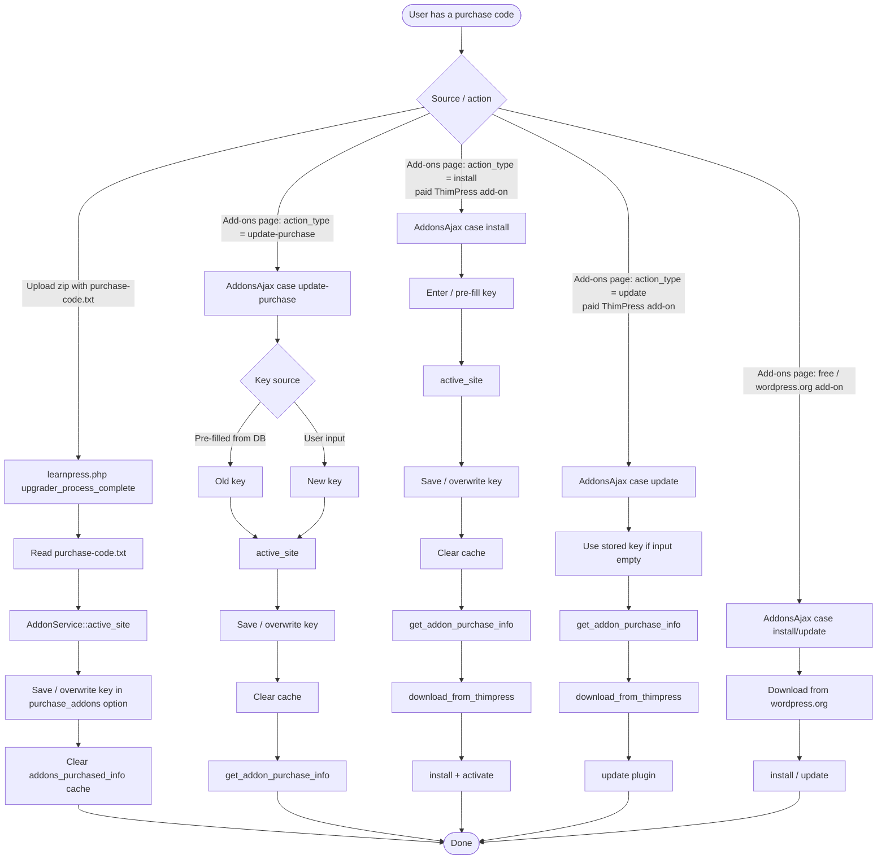

# Active Site Logic — Add-on Purchase Code

Logic for calling `active_site` and validating purchase codes for LearnPress add-ons. **Does not** describe the UI input steps.

## Flow overview

## What each service method does

- **`AddonService::active_site()`** — registers the site with the ThimPress server, saves/overwrites the purchase code in the `purchase_addons` option, and clears the `addons_purchased_info` cache. Called for `install` and `update-purchase` actions.
- **`AddonService::get_addon_purchase_info()`** — validates the purchase code against the `info-addons-purchased` endpoint and returns the purchase info object. It no longer persists the key or clears the cache.
- **`AddonService::download_from_thimpress()`** — downloads the ZIP from the `download-addon` endpoint; for paid add-ons it includes `purchase_code` in the request body. It does **not** update the `purchase_addons` option anymore.
- **`AddonService::install()` / `update()`** — run `Plugin_Upgrader` and activate/re-activate the plugin.

## Code locations

| Scenario | File | Code area | Notes |
|---|---|---|---|
| Upload zip with `purchase-code.txt` | `learnpress.php` | `add_action( 'upgrader_process_complete', ... )` | Reads `purchase-code.txt` and calls `AddonService::active_site()` only. |
| `update-purchase` | `inc/Ajax/AddonsAjax.php` | `case 'update-purchase'` | Calls `active_site()` then `get_addon_purchase_info()`. |
| `install` paid add-on | `inc/Ajax/AddonsAjax.php` | `case 'install'` | Calls `active_site()` → `get_addon_purchase_info()` → `download_from_thimpress()` → `install()`. |
| `update` paid add-on | `inc/Ajax/AddonsAjax.php` | `case 'update'` | Uses stored key if input is empty, then `get_addon_purchase_info()` → `download_from_thimpress()` → `update()`. Does **not** call `active_site()`. |
| Free / wordpress.org add-on | `inc/Ajax/AddonsAjax.php` | `case 'install'` / `case 'update'` | Skips `active_site()` / `get_addon_purchase_info()`; downloads directly from wordpress.org. |

## Notes

- The `update` action is a plugin-version update, not a purchase-code re-activation. It only fetches the stored key when the input is empty.
- After the paid `install` flow, WordPress also fires `upgrader_process_complete`; if the downloaded ZIP contains `purchase-code.txt`, the learnpress.php hook calls `active_site()` again (idempotent save/clear).
- `download_from_thimpress()` should not persist the key; persistence belongs in `active_site()` or, if needed for `update`, in `get_addon_purchase_info()`.
