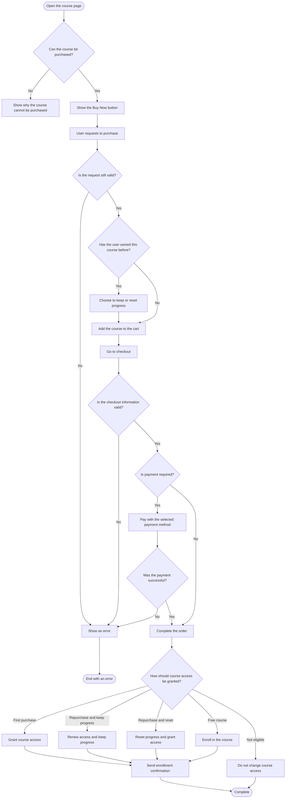

# Purchase Course — Human-readable Logic

```mermaid
flowchart TD
    Start([Open the course page]) --> CanBuy{Can the course be purchased?}
    CanBuy -->|No| Message[Show why the course cannot be purchased]
    CanBuy -->|Yes| Buy[Show the Buy Now button]

    Buy --> Request[User requests to purchase]
    Request --> Valid{Is the request still valid?}
    Valid -->|No| Error[Show an error]
    Valid -->|Yes| Repurchase{Has the user owned this course before?}
    Repurchase -->|Yes| Choice[Choose to keep or reset progress]
    Repurchase -->|No| Cart[Add the course to the cart]
    Choice --> Cart

    Cart --> Checkout[Go to checkout]
    Checkout --> CheckoutValid{Is the checkout information valid?}
    CheckoutValid -->|No| Error
    CheckoutValid -->|Yes| Payment{Is payment required?}
    Payment -->|Yes| Pay[Pay with the selected payment method]
    Pay --> PaySuccess{Was the payment successful?}
    PaySuccess -->|No| Error
    PaySuccess -->|Yes| Complete[Complete the order]
    Payment -->|No| Complete

    Complete --> Access{How should course access be granted?}
    Access -->|First purchase| Create[Grant course access]
    Access -->|Repurchase and keep progress| Keep[Renew access and keep progress]
    Access -->|Repurchase and reset| Reset[Reset progress and grant access]
    Access -->|Free course| Enroll[Enroll in the course]
    Access -->|Not eligible| NoChange[Do not change course access]

    Create --> Notify[Send enrollment confirmation]
    Keep --> Notify
    Reset --> Notify
    Enroll --> Notify
    Notify --> Done([Complete])
    NoChange --> Done
    Error --> EndError([End with an error])
```
