# Purchase Course — Business Logic

```mermaid
flowchart TD
    Start([Open single course page]) --> Render[SingleCourseTemplate::html_btn_purchase_course]
    Render --> CanPurchase{CourseModel::can_purchase succeeds?}
    CanPurchase -->|No| ShowCode{Error code is configured to show?}
    ShowCode -->|Yes| Warning[Render warning message]
    ShowCode -->|No| Empty[Return filtered empty output]
    CanPurchase -->|Yes| LegacyFilter{Legacy can-show filter allows button?}
    LegacyFilter -->|No| Empty
    LegacyFilter -->|Yes| BuyNow[Render form.purchase-course and Buy Now button]

    BuyNow --> Submit[User submits purchase form]
    Submit --> Rest[POST lp/v1/courses/purchase-course]
    Rest --> RestValid{Course ID, course, and can_purchase valid?}
    RestValid -->|No| RestError[Return error message]
    RestError --> FrontError[Show toast and restore button]
    RestValid -->|Yes| Repurchase{Existing user course with popup repurchase enabled and no choice?}
    Repurchase -->|Yes| Popup[Return keep/reset repurchase popup]
    Popup --> Choice[User selects keep or reset]
    Choice --> Rest
    Repurchase -->|No| CartMode{Cart enabled?}
    CartMode -->|No| EmptyCart[Empty current cart]
    CartMode -->|Yes| AddCart[Add course to cart]
    EmptyCart --> AddCart
    AddCart --> Added{Cart item created?}
    Added -->|No| RestError
    Added -->|Yes| SaveChoice{Repurchase choice and existing user course?}
    SaveChoice -->|Yes| ChoiceMeta[Save _lp_allow_repurchase_type]
    SaveChoice -->|No| CheckoutURL[Resolve checkout URL]
    ChoiceMeta --> CheckoutURL
    CheckoutURL --> HasURL{Checkout page configured?}
    HasURL -->|No| RestError
    HasURL -->|Yes| RedirectCheckout[Return success and redirect to checkout]

    RedirectCheckout --> Checkout[User selects payment method and clicks Place order]
    Checkout --> CheckoutJS[checkout.js serializes form]
    CheckoutJS --> Ajax[POST lp-ajax=checkout]
    Ajax --> Handler[LP_AJAX::checkout]
    Handler --> ProcessHandler[LP_Checkout::process_checkout_handler]
    ProcessHandler --> Post{Request method is POST?}
    Post -->|No| Stop([Stop])
    Post -->|Yes| Process[LP_Checkout::process_checkout]

    Process --> CartValid{Cart non-empty and item types valid?}
    CartValid -->|No| CheckoutError[Return failure message]
    CartValid -->|Yes| FieldsValid{Nonce and checkout fields valid?}
    FieldsValid -->|No| CheckoutError
    FieldsValid -->|Yes| NeedsPayment{Cart needs payment?}
    NeedsPayment -->|Yes| PaymentValid{Selected gateway exists and validates?}
    PaymentValid -->|No| CheckoutError
    PaymentValid -->|Yes| Recheck[Recheck course purchase or free-course enrollment]
    NeedsPayment -->|No| Recheck
    Recheck --> Allowed{Course still allowed?}
    Allowed -->|No| CheckoutRedirectError[Return checkout redirect with error]
    Allowed -->|Yes| Awaiting{Session has order awaiting payment?}
    Awaiting -->|No| CreateOrder[Create pending order and line items for user or guest]
    Awaiting -->|Yes| OrderReady[Reuse awaiting order]
    CreateOrder --> Created{Order created?}
    Created -->|No| CheckoutError
    Created -->|Yes| OrderReady

    OrderReady --> Gateway{Payment gateway instance exists?}
    Gateway -->|Yes| Pay[LP_Gateway_Abstract::process_payment]
    Pay --> PaySuccess{Gateway result is success?}
    PaySuccess -->|No| CheckoutError
    PaySuccess -->|Yes| ClearPaid[Empty cart and return payment redirect]
    Gateway -->|No, free course| CompleteFree[LP_Order::payment_complete]
    CompleteFree --> FreeSuccess{Order completed?}
    FreeSuccess -->|No| CheckoutError
    FreeSuccess -->|Yes| ClearFree[Empty cart and return order-received redirect]

    ClearPaid --> StatusChanged[learn-press/order/status-changed]
    ClearFree --> StatusChanged
    StatusChanged --> NewStatus{New order status}
    NewStatus -->|Completed| Completed[LP_User_Factory::_update_user_item_order_completed]
    NewStatus -->|Pending / Processing / Cancelled / Failed / Refunded| WasCompleted{Old status was Completed?}
    WasCompleted -->|No| EndNoChange([No user-course change])
    WasCompleted -->|Yes| CancelAccess[Set matching user-course status to Cancel]

    Completed --> CurrentOrder{Newer user-course order already exists?}
    CurrentOrder -->|Yes| EndNoChange
    CurrentOrder -->|No| Restore{Same order has cancelled user-course?}
    Restore -->|Yes| RestoreAccess[Restore Enrolled or Finished status]
    Restore -->|No| Manual{Manual order?}
    Manual -->|Yes| ManualHandler[Handle manual completed order]
    Manual -->|No| PurchaseType{Course access case}
    PurchaseType -->|Repurchase: keep| Keep[Update existing user-course and keep item progress]
    PurchaseType -->|Repurchase: reset| Reset[Replace user-course with reset course access]
    PurchaseType -->|First paid purchase| First[Create Purchased or Enrolled user-course]
    PurchaseType -->|Free or no enrollment requirement| FreeEnroll[Create Enrolled user-course]
    PurchaseType -->|Guest with guest checkout and auto-enroll| GuestEnroll[Create Enrolled guest user-course]
    PurchaseType -->|Not eligible| EndNoChange

    Keep --> Enrolled{Result status is Enrolled?}
    Reset --> Enrolled
    First --> Enrolled
    FreeEnroll --> Enrolled
    GuestEnroll --> Enrolled
    RestoreAccess --> Done([Course access updated])
    ManualHandler --> Done
    Enrolled -->|Yes| EnrollHook[Fire learnpress/user/course-enrolled and queue enrollment emails]
    Enrolled -->|No| Done
    EnrollHook --> Done
    CancelAccess --> Done
    CheckoutRedirectError --> EndCheckout([Checkout displays error])
    CheckoutError --> EndCheckout
```

## Authoritative entry points

- `SingleCourseTemplate::html_btn_purchase_course()` renders the purchase form.
- `purchaseCourse()` submits `POST lp/v1/courses/purchase-course` and handles repurchase selection.
- `LP_REST_Courses_Controller::purchase_course()` validates the request, updates the cart, and returns the checkout redirect.
- `window.lpCheckout.submit()` posts the checkout form to `lp-ajax=checkout`.
- `LP_AJAX::checkout()` delegates to `LP_Checkout::process_checkout_handler()`.
- `LP_Checkout::process_checkout()` validates checkout, creates or reuses an order, and starts payment or completes a free order.
- `LP_User_Factory::update_user_items()` reacts to order status changes and updates course access.
